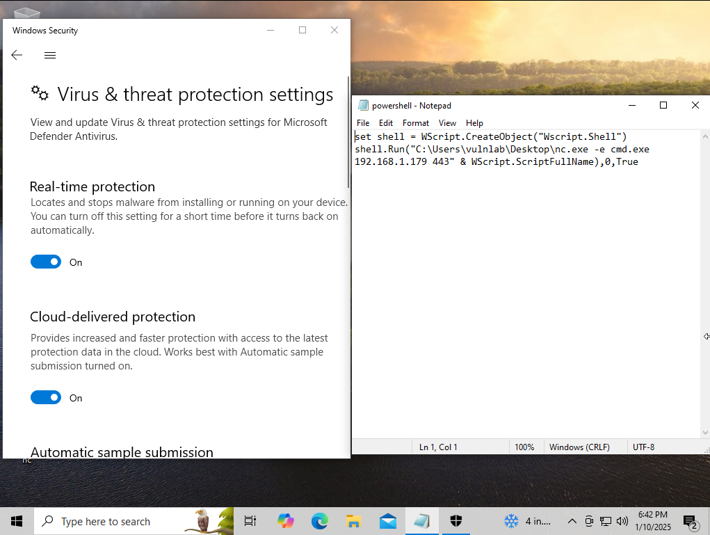
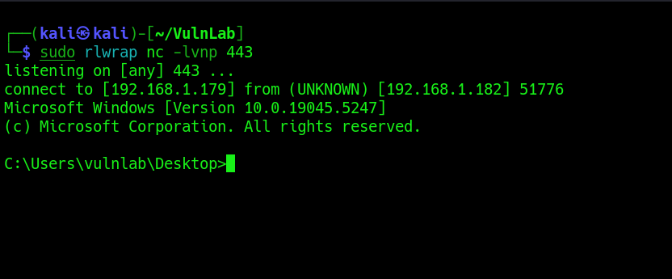

<h1>VBScript</h1>

<h2>Description</h2>
This repository contains the method of executing code through VBScript.<br />

<h2>Languages and Utilities Used</h2>
- <b>VBScript</b><br />

<h2>Environments Used </h2>

- <b>Windows 10</b>

<h2>Execution</h2>
<b>Script Creation</b><br />
Utilizing the following script we can leverage a binary tool already installed on the Windows host to make a connection to the Kali Linux instance, despite Windows Defender being enabled:
 <p align="center">
  
 </p><br/>
<b>Execution</b><br />
This will utilizing the preinstalled NetCat binary to connect back to the target system. This can be leveraged with C2 payloads to connect the client to a C2 server:
 <p align="center">
  
 </p><br/>
 
 
 
 
 
 <!--
 ```diff
- text in red
+ text in green
! text in orange
# text in gray
@@ text in purple (and bold)@@
```
--!>
