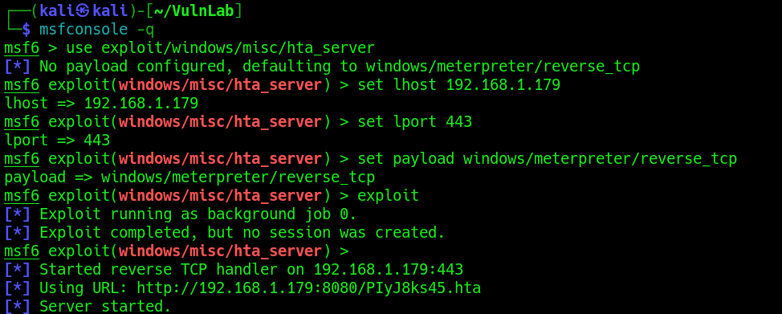
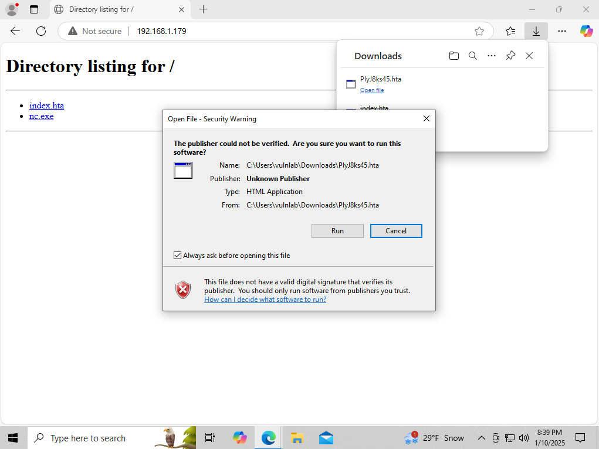
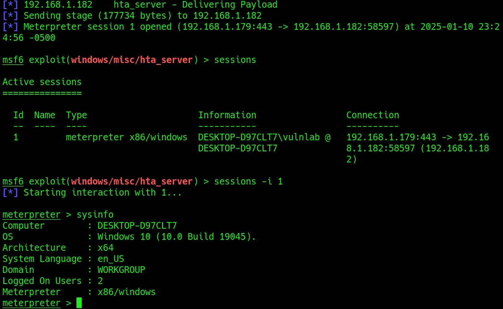

<h1>HTML Application</h1>

<h2>Description</h2>
This repository contains the method of executing code through HTML Application.<br />

<h2>Languages and Utilities Used</h2>
- <b>HTML & JScript</b><br />

<h2>Environments Used </h2>

- <b>Windows 10</b>

<h2>Execution</h2>
<b>Using Metasploit</b><br />
Utilizing the exploit/misc/hta_server we can automate the creation of the payload and setting up of the server hosting the payload:
 <p align="center">
  
 </p><br/>
<b>Execution</b><br />
On the target we must navigate to the payload through the browser and allow the code to run in order to gain a reverse connection:
 <p align="center">
  
 </p><br/>
<b>Connection</b><br />
Once it executes we'll gain a new session: 
 <p align="center">
  
 </p><br/>
 
 
 
 
 
 <!--
 ```diff
- text in red
+ text in green
! text in orange
# text in gray
@@ text in purple (and bold)@@
```
--!>
