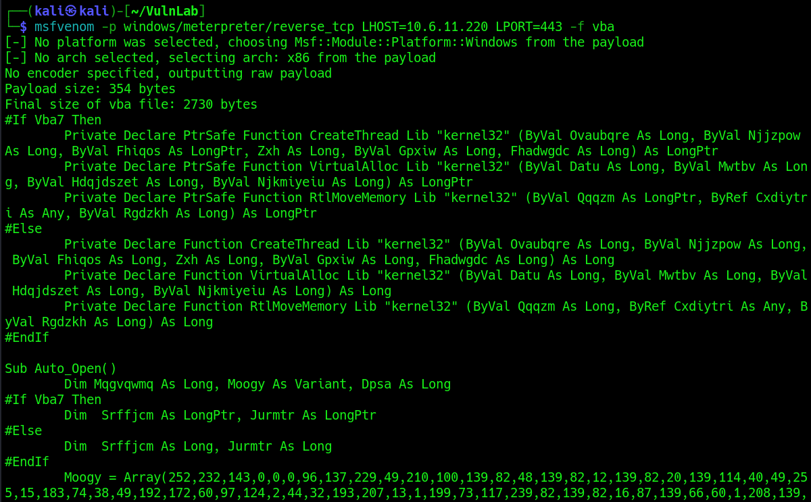
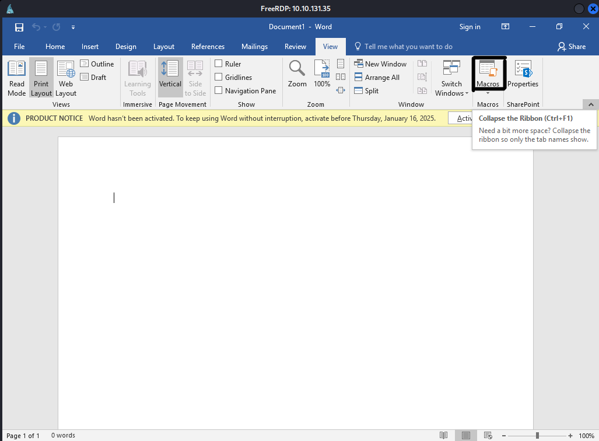
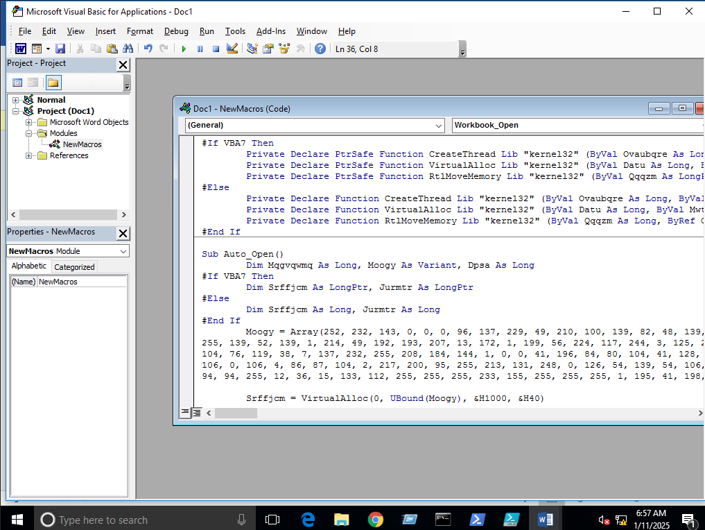
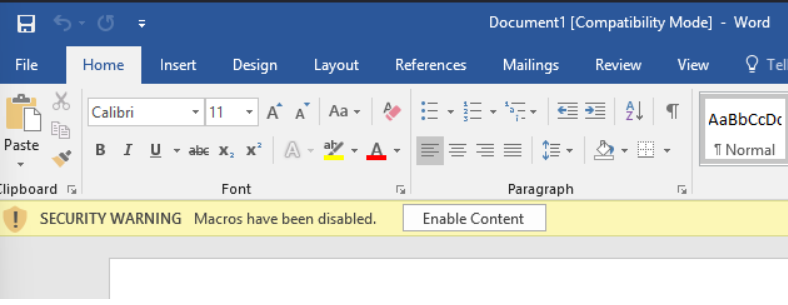
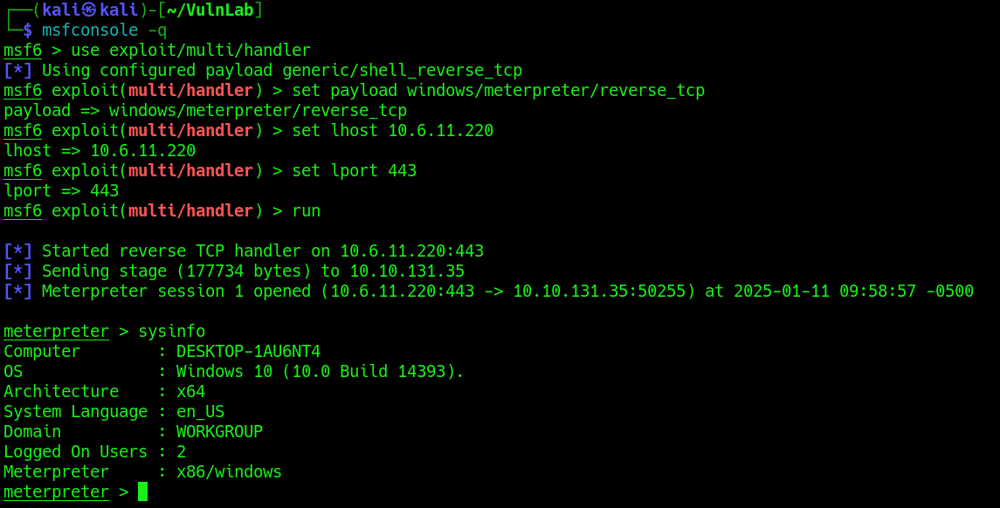

<h1>VBA</h1>

<h2>Description</h2>
This technique leverages Visual Basic for Applications or VBA, a programming language by Microsoft implemented for adding functionality to Microsoft Office applications.<br />

<h2>Languages and Utilities Used</h2>
- <b>Microsoft Office</b><br />
- <b>VBA</b><br />

<h2>Environments Used </h2>

- <b>Windows 10</b>

<h2>Execution</h2>
<b>Payload Creation</b><br />
Utilizing MSFVenom we can generate a payload to add to the Macros of a Office document:
 <p align="center">
  
 </p><br/>
<b>Creating Windows Document</b><br />
Next we'll open a Windows Document and under View you'll find the Macros tool:
 <p align="center">
  
 </p><br/>
<b>Embedding Payload</b><br />
Click Macros, add a name and select create. A workbook will open where we'll add our payload: 
 <p align="center">
  
 </p><br/>
<b>Saving Payload</b><br />
We must ensure that the payload is stored underneath the document name to embed it into the work document. Once this is done we'll save the document as Word 97-2003 Document. We'll close, then reopen the document and get an Enable Content button. Clicking this will enable the Macros to execute (Ensure your Metasploit listener is enabled): 
  <p align="center">
   
  </p><br/>
 <b>Gaining Reverse Shell</b><br />
 Once the payload executes we should have a reverse shell connection on our Metasploit Multi Handler:
   <p align="center">
   
  </p><br/>
 
 
 <!--
 ```diff
- text in red
+ text in green
! text in orange
# text in gray
@@ text in purple (and bold)@@
```
--!>
