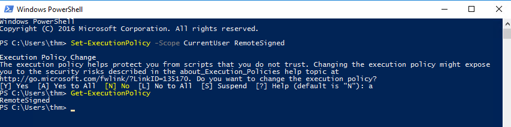
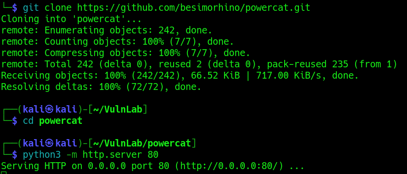
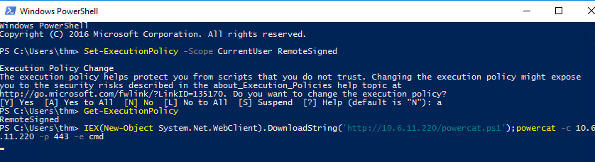
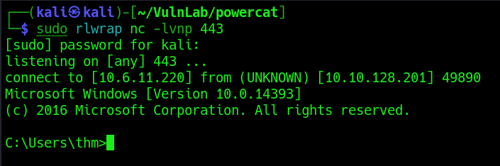

<h1>PowerShell</h1>

<h2>Description</h2>
PowerShell is a cross-platform scripting language commonly used to automate system administration.<br />

<h2>Languages and Utilities Used</h2>
- <b>PowerShell</b><br />

<h2>Environments Used </h2>

- <b>Windows 10</b>

<h2>Execution</h2>
<b>Enable Script Execution</b><br />
Enable script execution in PowerShell, using the following command <i>Set-ExecutionPolicy -Scope CurrentUser RemoteSigned</i>:
 <p align="center">
  
 </p><br/>
<b>Generate Payload</b><br />
I'll use two methods, the premade PowerCat.ps1 script and I will create a connection.ps1 script. Install PowerCat with <i>https://github.com/besimorhino/powercat.git</i>. Switch to this directory and start an HTTP server:
 <p align="center">
  
 </p><br/>
<b>Invoke Expression</b><br />
Next, we'll use the invoke expression function (<i>IEX</i>) to make a web request and download the content of the powershell script and execute the powercat command:
 <p align="center">
  
  
 </p><br/>
 
 
 
 
 <!--
 ```diff
- text in red
+ text in green
! text in orange
# text in gray
@@ text in purple (and bold)@@
```
--!>
