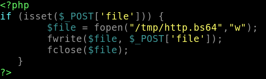
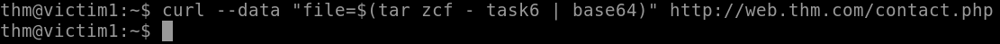
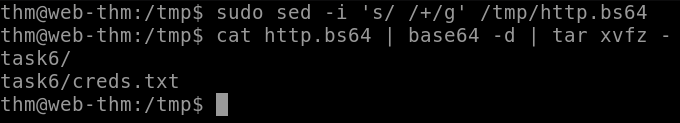

<h1>Data Exfiltration</h1>

<h2>Description</h2>
This repository will contain the method of performing data exfiltration using HTTP<br />

<h2>Manual Webserver Exfiltration</h2>
<b>Step 1: Create a PHP file</b><br />
Create a PHP file that handles data pass to the webserver:
<p align="center">
  
</p><br/>
<b>Step 2: Transfer Data</b><br />
Now we can transfer the data using the curl command from the target system: 
<p align="center">
  
</p><br/>
<b>Step 3: Edit and Decode the Content</b><br />
When data is passed through HTTP the data becomes URL encode which leaves us with broken Base64 encoding. The <i>sed</i> command will replace all the spaces with + symbols, making it valid Base64. Then we can decode it to view the content:
<p align="center">
  
</p><br/>


<!--
 ```diff
- text in red
+ text in green
! text in orange
# text in gray
@@ text in purple (and bold)@@
```
--!>
