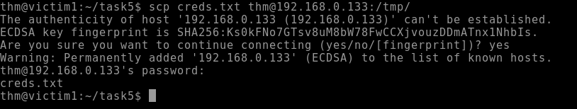
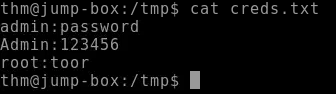
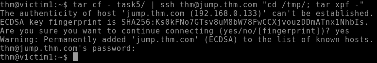
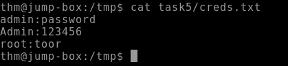

<h1>Data Exfiltration</h1>

<h2>Description</h2>
This repository will contain the method of performing data exfiltration using TCP Sockets.<br />

<h2>Exfiltration</h2>
<b>SCP File Transfer</b><br />
Utilize SCP from the target, specify the file and the directory to where you want to store the file:
<p align="center">
  
</p><br/>
<b>View SCP Content</b><br />
Returning to our host machine we can view the content of the file:
<p align="center">
  
</p><br/>
<b>SSH File Transfer</b><br />
Utilize SSH from the target, first we'll archive the file and thenuse SSH to transfer the file and execute one command to place the file in the tmp directory and extract the content:
<p align="center">
  
</p><br/>
<b>View SSH Content</b><br />
We can now view the content on our host:
<p align="center">
  
</p><br/>

<!--
 ```diff
- text in red
+ text in green
! text in orange
# text in gray
@@ text in purple (and bold)@@
```
--!>
